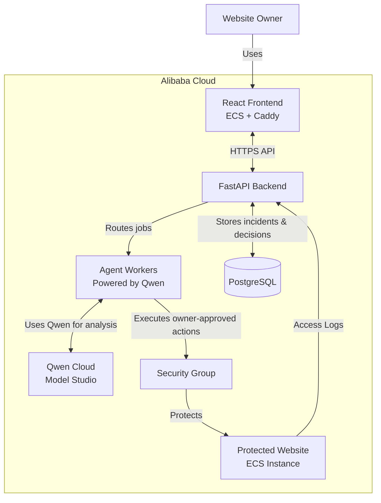

# SecAi

Cyberattacks are on the rise now more than ever. Companies and establishments of every type and size have been, and continue to be, targeted. Small businesses and everyday owners are not left out of the conversation. While big companies have the resources to hire and keep a cybersecurity team, small everyday businesses often don't. Should we let them continue to be defenseless? That's unfair — even in this unfair world. The solution? SecAi!

SecAi is a Qwen-powered, autonomous AI agent that helps detect known and potential cyber attacks, brings them to the attention of the owner, and offers a quick, fast line of protection to minimize potential impact before further action can be taken by the appropriate people.

## Architecture



[User flow](docs/USER_FLOW.md) 


## How it works

SecAi turns suspicious website activity into a report a non-technical person can actually understand and act on. The Investigator  subagent looks at the evidence, a reviewer sub agent pushes back on the conclusion, and a Responder writes up the report and recommends what to do next, The executor 

If trusted Alibaba Cloud logs contain a verified public source IP, the owner can approve a temporary block for that one IP. SecAi applies the security-group rule, checks Alibaba's real rule ID to confirm it actually took effect, and can roll it back later — automatically when it expires, or right away if the owner asks.

The essence is to handle ambiguous security signals end to end: call Qwen and Alibaba Cloud tools, stop and wait for a human before touching any traffic, then verify or undo whatever it did.

## Evidence sources

There are two ways to feed SecAi evidence:

- **Alibaba Cloud integration.** This is the recommended path if your site is on Alibaba. It pulls from Alibaba SLS, which gives SecAi real server-observed logs — response status, request context, and the public source IP it needs to make a safe network decision. This is also the only path that can act, not just recommend.
- **Browser script.** Works on any host, any provider. Much easier to set up, but it can only catch what's visible from the frontend — things like ten submissions to the same form within ten seconds. It never sees form values, and sensitive fields are skipped. It can flag something and recommend an action, but it has no access to actually do anything about it.

## Safety boundary

- A network action can target only one global public IP observed in trusted SLS evidence.
- IP ranges are not supported.
- Every block requires explicit owner approval; there is no automatic or preapproved enforcement path.
- Protected CIDRs, private/reserved addresses, evidence mismatch, and missing Alibaba capabilities fail closed.
- Qwen recommends an action, but deterministic Python validates it before the agent calls Alibaba Cloud.
- A block is successful only after SecAi reads back and stores the provider's `SecurityGroupRuleId`.
- Removal or expiry revokes that exact rule ID and records the rollback.

## Technical details

The agent side is split into three roles that do the actual reasoning — Investigator, Reviewer, Responder — plus a separate Executor that only fires once a job is approved and eligible to run. Harmless activity gets filtered out early so it doesn't burn a Qwen tokens for nothing, and low-signal events need to repeat into a pattern before SecAi investigates at all.

Investigations aren't are grounded in CAPEC, CWE, and OWASP data pulled through a dedicated knowledge MCP server and not just guessed from memory. A second, separate MCP server handles the actual action tools, gated behind approval, so the reasoning side and the "can change security group cloud" side stay apart.

Jobs (both investigations and actions) are persisted rather than run inline, so a slow model call or provider round-trip doesn't sit inside a request. And Alibaba access is scoped per website: no AccessKeys are ever stored, each site gets its own generated RAM role, and the owner creates that role in their own account and only ever hands SecAi back a role ARN.

### Stack
- FastAPI backend
- React dashboard
- Postgres
- Qwen via Model Studio
- Alibaba SLS/ECS for evidence and enforcement
- Discord as an optional second notification channel.

## Why Qwen, why Alibaba Cloud

Qwen does the actual reasoning — reading raw evidence, deciding if it's a real threat, and writing something a non-technical owner can follow. The three-role setup (Investigator, Reviewer, Responder) exists because a single pass is easier to fool; having a second role actively challenge the first one's conclusion catches false positives before they ever reach a person.

Alibaba Cloud is what makes the "act on it" half possible, not just the "detect it" half. SLS gives SecAi trustworthy server-side evidence — including the public IP a block decision actually depends on — and ECS security groups give it something real to change once a human signs off.

## Limitations

SecAi is intentionally narrow right now, on purpose:

- It can block a single verified IP — not a range, not a subnet, not a pattern of IPs.
- It only reacts to what's in the logs it's given. It doesn't do WAF-style inline filtering or traffic shaping.
- Every action needs a human in the loop. There's no autonomous mode, and that's a deliberate choice, not a missing feature.

## Run locally

```bash
python -m venv .venv
.venv/bin/pip install -r requirements-dev.lock

# set required environment variables, including DASHSCOPE_API_KEY
# (needs a Singapore Model Studio pay-as-you-go key — see deploy/alibaba_cloud.md)

.venv/bin/python main.py
```

```bash
cd frontend
npm ci
npm run dev
```

For connecting a real Alibaba account, provisioning SLS, and the full test sequence, see [`deploy/alibaba_cloud.md`](deploy/alibaba_cloud.md).

## Project map

- `secai/agent/` — Investigator, Reviewer, Responder, structured outputs, tools, safety validation.
- `secai/event_sources/` — SLS and browser intake, normalization, grouping, relevance checks, polling.
- `secai/integrations/` — Qwen, Alibaba SLS/ECS credentials and execution, Discord.
- `secai/actions/` — approval, enforcement, verification, rollback, policy expiry.
- `secai/dashboard_api/` — authenticated owner API, setup, ingest, Discord interactions.
- `secai/knowledge/` — CAPEC/CWE/OWASP/NVD/OSV-backed security tools.
- `frontend/` — React dashboard.
- `protected_site/` — sample storefront for testing attack detection end to end.
- `deploy/` — Compose and Caddy examples.

See  [Alibaba Cloud deployment proof](docs/ALIBABA_CLOUD_PROOF.md).
