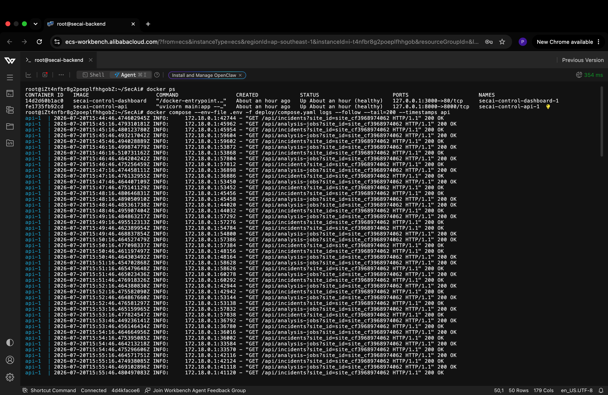
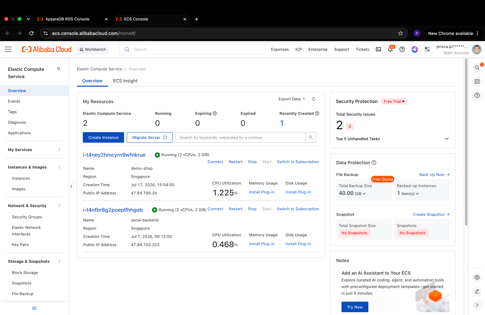
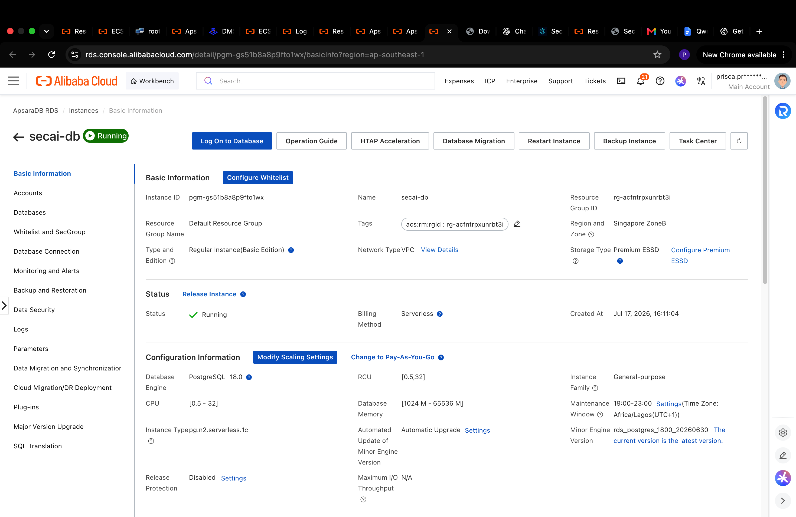

# Alibaba Cloud deployment proof

## Key Alibaba Cloud Services Used

- **Simple Log Service (SLS)**: Real-time log collection from protected ECS instances.
- **Elastic Compute Service (ECS)**: Backend + protected demo storefront.
- **Security Groups**: Dynamic IP blocking and rollback.
- **RAM Roles + STS**: Secure cross-account access (no stored AccessKeys).
- **Qwen Model Studio**: All agent reasoning.

- **[Qwen Cloud API configuration](https://github.com/priscaa40/SecAi/blob/main/secai/integrations/qwen_cloud.py)** shows the required `https://dashscope-intl.aliyuncs.com/compatible-mode/v1` endpoint used by the deployed agent workflow.
- **[Alibaba ECS API integration](https://github.com/priscaa40/SecAi/blob/main/secai/integrations/alibaba_ecs.py)** shows the backend calling Alibaba Cloud services for the verified action lifecycle.

The ECS integration constructs Alibaba SDK requests and calls `AuthorizeSecurityGroup`, `DescribeSecurityGroupAttribute`, and `RevokeSecurityGroup`. It is invoked only for an owner-approved action, and SecAi reads the security group back to verify Alibaba's real rule ID.

## Visual deployment evidence

## Supporting code evidence

- [SLS ingestion](../secai/event_sources/alibaba_sls.py) reads trusted website logs through Alibaba's Log Service SDK.
- [ROS onboarding automation](../secai/integrations/alibaba_autopilot.py) generates the RAM role and the collector stack, including index-aware SLS setup, machine group, LoongCollector installation through ECS RunCommand, documented Docker stdout collection, and machine-group binding. SecAi parses the collected JSON after reading it from SLS.
- [Temporary Alibaba credentials](../secai/integrations/alibaba_credentials.py) assumes each website's RAM role instead of storing customer AccessKeys.
- [Verified security-group lifecycle](../secai/integrations/alibaba_security_groups.py) applies, reads back, records, and rolls back the approved ECS rule.
- [Alibaba deployment guide](../deploy/alibaba_cloud.md) documents the running ECS, RDS, SLS, RAM, ROS, Docker, and Caddy deployment.
