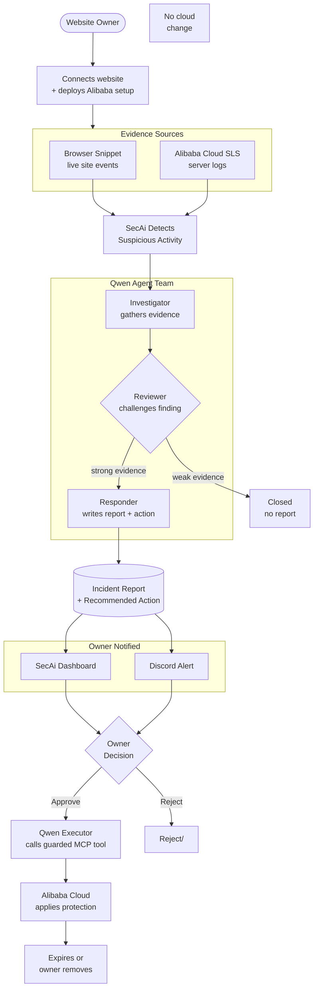

<!-- user worklow.md -->
# User flow

SecAi accepts evidence through either the Alibaba Cloud integration or the lightweight browser snippet. Both paths enter the same durable investigation pipeline, but only trusted Alibaba server evidence can authorize a network response.

